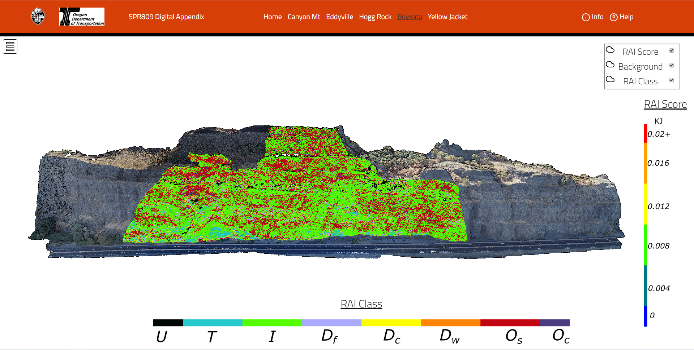

# SPR809 Digital Appendix

## About

This is a simple web project developed during the SPR809 research project conducted by researchers at Oregon State University on behalf of the Oregon Department of Transportation. The purpose of the web page is to serve as a digital appendix to display 3D pointcloud data representative of rockfall hazards. This is otherwise difficult to illustrate in a traditional static 2D report.

[View the webpage here!](https://research.engr.oregonstate.edu/geomatics/projects/rockfall/spr-809/digital-appendix/ "SPR809 Digital Appendix")

## Features

This project contains a home page explaining the project, and customized potree viewers that display the pointcloud datasets for each of the five sites.

### Site Pages
Pages contain a responsive navigation bar that uses [bootstrap](https://getbootstrap.com/) allowing navigation between sites.
Pointclouds are rendered using [potree](http://potree.org/). The following changes were made to default potree webpages to simplify and streamline the user experience:

- The "Scene" submenu was moved out of the toolbox and moved to the top-right hand corner.
- "info" and "help" modals were added to explain background information and how to best utilize the webpage.
- Interactive, responsive scale bars were added allowing users to query classification types.
- The toolbox was streamlined by removing un-used items to simplify the page for users unfamiliar with [potree](http://potree.org/).
- custom styling using CSS was applied to the page to maintain a pleasing and consistent ui across pages/elements.

## Dependencies
The following libraries are utilized in this build:
- [Potree](http://potree.org/)
- [j-query](https://jquery.com/)
- [three.js](https://threejs.org/)
- [bootstrap](https://getbootstrap.com/)

## Acknowledgements and Disclaimer
The data displayed on this page was collected as part of the Oregon Department of Transportation SPR809 research project. Any opinions, findings, and conclusions or recommendations expressed in this material are those of the author(s) and do not necessarily reflect the views of the Oregon Department of Transportation or Oregon State University
